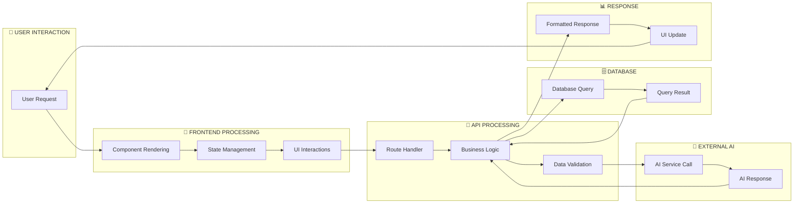
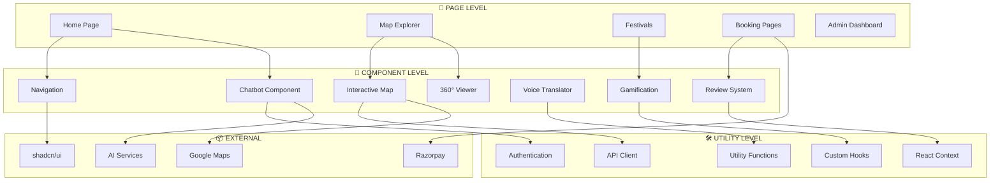
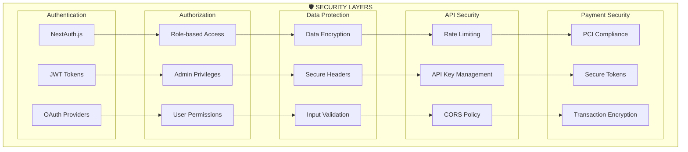
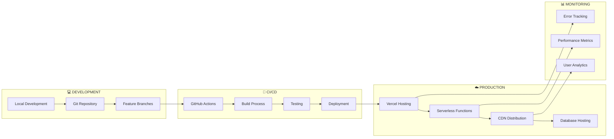

# 🏗️ **Jharkhand Tourism Website - System Architecture Flowchart**

## 📊 **Complete System Architecture Overview**

```mermaid
graph TB
    %% User Layer
    subgraph "👤 USER LAYER"
        U1[Mobile Users]
        U2[Desktop Users]
        U3[Admin Users]
        U4[Tourism Officials]
    end

    %% Frontend Layer
    subgraph "🎨 FRONTEND LAYER (Next.js 14)"
        subgraph "Core Pages"
            P1[Home Page]
            P2[Map Explorer]
            P3[Festivals]
            P4[Places]
            P5[Cultural Heritage]
            P6[Booking Pages]
            P7[Admin Dashboard]
        end
        
        subgraph "Interactive Components"
            C1[AI Chatbot]
            C2[360° Viewer]
            C3[Interactive Map]
            C4[Voice Translator]
            C5[Gamification System]
            C6[Review System]
        end
        
        subgraph "UI Framework"
            UI1[shadcn/ui Components]
            UI2[Tailwind CSS]
            UI3[Framer Motion]
            UI4[Responsive Design]
        end
    end

    %% API Layer
    subgraph "🔌 API LAYER (Next.js API Routes)"
        subgraph "AI Services"
            A1[/api/chat - AI Chatbot]
            A2[/api/translate - Translation]
            A3[/api/voice - Speech Processing]
        end
        
        subgraph "Booking Services"
            B1[/api/hotels - Hotel Booking]
            B2[/api/flights - Flight Booking]
            B3[/api/payments - Payment Processing]
            B4[/api/bookings - Booking Management]
        end
        
        subgraph "Content Services"
            S1[/api/places - Places Data]
            S2[/api/reviews - User Reviews]
            S3[/api/gamification - Gaming]
            S4[/api/distance - Location Services]
        end
        
        subgraph "Admin Services"
            AD1[/api/admin/dashboard - Analytics]
            AD2[/api/admin/faq - FAQ Management]
            AD3[/api/admin/users - User Management]
        end
    end

    %% External Services Layer
    subgraph "🌐 EXTERNAL SERVICES"
        subgraph "AI/ML Services"
            AI1[OpenAI GPT API]
            AI2[DeepSeek API]
            AI3[HuggingFace API]
            AI4[Google Translate API]
        end
        
        subgraph "Map Services"
            M1[Google Maps API]
            M2[Google Street View API]
            M3[Distance Matrix API]
            M4[Leaflet/OpenStreetMap]
        end
        
        subgraph "Payment & Auth"
            PAY1[Razorpay Gateway]
            AUTH1[NextAuth.js]
            AUTH2[Google OAuth]
        end
        
        subgraph "Media Services"
            MED1[Pannellum 360° Viewer]
            MED2[Web Speech API]
            MED3[Image Optimization]
        end
    end

    %% Database Layer
    subgraph "🗄️ DATABASE LAYER"
        subgraph "Primary Database"
            DB1[(PostgreSQL Database)]
        end
        
        subgraph "Data Models"
            DM1[Users & Profiles]
            DM2[Bookings & Payments]
            DM3[Reviews & Ratings]
            DM4[Tourist Spots Data]
            DM5[Cultural Content]
            DM6[Gamification Data]
        end
        
        subgraph "ORM"
            ORM1[Prisma ORM]
            ORM2[Database Migrations]
            ORM3[Query Optimization]
        end
    end

    %% Data Storage Layer
    subgraph "📁 DATA STORAGE"
        subgraph "Static Content"
            ST1[Tourist Spot Images]
            ST2[360° Panoramic Images]
            ST3[Cultural Assets]
            ST4[Festival Media]
        end
        
        subgraph "Configuration Data"
            CF1[Jharkhand Boundary GeoJSON]
            CF2[Tourist Spots JSON]
            CF3[Cultural Data JSON]
            CF4[Points of Interest]
        end
    end

    %% Infrastructure Layer
    subgraph "☁️ INFRASTRUCTURE"
        subgraph "Deployment"
            INF1[Vercel Hosting]
            INF2[CDN Distribution]
            INF3[Serverless Functions]
        end
        
        subgraph "Performance"
            PERF1[Image Optimization]
            PERF2[Code Splitting]
            PERF3[Lazy Loading]
            PERF4[Caching Strategy]
        end
        
        subgraph "Monitoring"
            MON1[Error Tracking]
            MON2[Analytics]
            MON3[Performance Monitoring]
        end
    end

    %% Connections - User to Frontend
    U1 --> P1
    U2 --> P1
    U3 --> P7
    U4 --> P7

    %% Frontend Internal Connections
    P1 --> C1
    P2 --> C3
    P2 --> C2
    P3 --> C5
    P6 --> C6
    
    C4 --> UI1
    C1 --> UI2
    C2 --> UI3
    
    %% Frontend to API Connections
    C1 --> A1
    C4 --> A2
    C4 --> A3
    P6 --> B1
    P6 --> B2
    P6 --> B3
    C6 --> S2
    C5 --> S3
    C3 --> S4
    P7 --> AD1
    
    %% API to External Services
    A1 --> AI1
    A1 --> AI2
    A1 --> AI3
    A2 --> AI4
    A3 --> AI4
    
    C3 --> M1
    C2 --> M2
    S4 --> M3
    C3 --> M4
    
    B3 --> PAY1
    P6 --> AUTH1
    AUTH1 --> AUTH2
    
    C2 --> MED1
    A3 --> MED2
    P1 --> MED3
    
    %% API to Database
    A1 --> DB1
    B1 --> DB1
    B2 --> DB1
    B3 --> DB1
    S1 --> DB1
    S2 --> DB1
    S3 --> DB1
    AD1 --> DB1
    
    %% Database Internal
    DB1 --> DM1
    DB1 --> DM2
    DB1 --> DM3
    DB1 --> DM4
    DB1 --> DM5
    DB1 --> DM6
    
    ORM1 --> DB1
    ORM2 --> DB1
    ORM3 --> DB1
    
    %% Data Storage Connections
    P1 --> ST1
    C2 --> ST2
    P3 --> ST3
    P3 --> ST4
    
    C3 --> CF1
    S1 --> CF2
    P3 --> CF3
    C3 --> CF4
    
    %% Infrastructure Connections
    P1 --> INF1
    ST1 --> INF2
    A1 --> INF3
    
    P1 --> PERF1
    C1 --> PERF2
    C2 --> PERF3
    DB1 --> PERF4
    
    INF1 --> MON1
    U1 --> MON2
    API1 --> MON3

    %% Styling
    classDef userClass fill:#e1f5fe,stroke:#0277bd,stroke-width:2px
    classDef frontendClass fill:#f3e5f5,stroke:#7b1fa2,stroke-width:2px
    classDef apiClass fill:#e8f5e8,stroke:#388e3c,stroke-width:2px
    classDef externalClass fill:#fff3e0,stroke:#f57c00,stroke-width:2px
    classDef databaseClass fill:#fce4ec,stroke:#c2185b,stroke-width:2px
    classDef storageClass fill:#f1f8e9,stroke:#689f38,stroke-width:2px
    classDef infraClass fill:#e0f2f1,stroke:#00695c,stroke-width:2px

    class U1,U2,U3,U4 userClass
    class P1,P2,P3,P4,P5,P6,P7,C1,C2,C3,C4,C5,C6,UI1,UI2,UI3,UI4 frontendClass
    class A1,A2,A3,B1,B2,B3,B4,S1,S2,S3,S4,AD1,AD2,AD3 apiClass
    class AI1,AI2,AI3,AI4,M1,M2,M3,M4,PAY1,AUTH1,AUTH2,MED1,MED2,MED3 externalClass
    class DB1,DM1,DM2,DM3,DM4,DM5,DM6,ORM1,ORM2,ORM3 databaseClass
    class ST1,ST2,ST3,ST4,CF1,CF2,CF3,CF4 storageClass
    class INF1,INF2,INF3,PERF1,PERF2,PERF3,PERF4,MON1,MON2,MON3 infraClass
```

## 🔄 **Data Flow Architecture**



## 🏛️ **Component Architecture**



## 🔒 **Security Architecture**



## 🚀 **Deployment Architecture**



---

## 📋 **Architecture Summary**

### **🎨 Frontend Architecture**
- **Framework**: Next.js 14 with App Router
- **Components**: React with TypeScript
- **Styling**: Tailwind CSS + shadcn/ui
- **State**: React hooks and Context API
- **Routing**: File-based routing with dynamic routes

### **🔌 Backend Architecture**
- **API**: Next.js API Routes (serverless)
- **Database**: PostgreSQL with Prisma ORM
- **Authentication**: NextAuth.js with OAuth
- **External APIs**: Multiple AI providers, Google services
- **Payment**: Razorpay integration

### **🗄️ Data Architecture**
- **Database**: Relational PostgreSQL database
- **ORM**: Prisma for type-safe queries
- **Static Data**: JSON files for configuration
- **Media Storage**: Optimized image delivery
- **Caching**: Multiple caching layers

### **🌐 External Integrations**
- **AI Services**: OpenAI, DeepSeek, HuggingFace
- **Maps**: Google Maps, Street View, Distance Matrix
- **Translation**: Google Translate API
- **Payment**: Razorpay gateway
- **Auth**: Google OAuth provider

### **☁️ Infrastructure**
- **Hosting**: Vercel with serverless functions
- **CDN**: Global content delivery
- **Database**: Managed PostgreSQL
- **Monitoring**: Error tracking and analytics
- **Performance**: Optimized builds and caching

This architecture ensures **scalability**, **performance**, **security**, and **maintainability** while providing a rich, interactive user experience for Jharkhand tourism.